# Engine atlas

An exact map of the Sinew & Steel resolution engine at version 0.4.0: every interaction between attributes, Advantage, margin, edge, soak, Stamina, Luck, build points, milestones and the Pressure fuse, with the discontinuities named and the powerbuilding routes priced. It exists so that further tuning can be argued from numbers rather than impressions, by the author, by an AI reviewer, or by a playtester.

Everything here is exact enumeration over the d20 (400 cells for an opposed test, absorbing Markov chains for time to drop and for the Luck pool), computed by `tools/analysis/atlas.py`. The full data tables are in [engine_atlas/tables.md](engine_atlas/tables.md); the figures are in `engine_atlas/figures/`. Regenerate both with:

```bash
uv run --extra analysis python tools/analysis/atlas.py
```

Where a table assumes something the rules leave to the Custodian (how often a beat calls for a roll, how often Pressure ticks), the assumption is stated in the table title. Change the constants at the top of the script to test another.

## 1. The single test

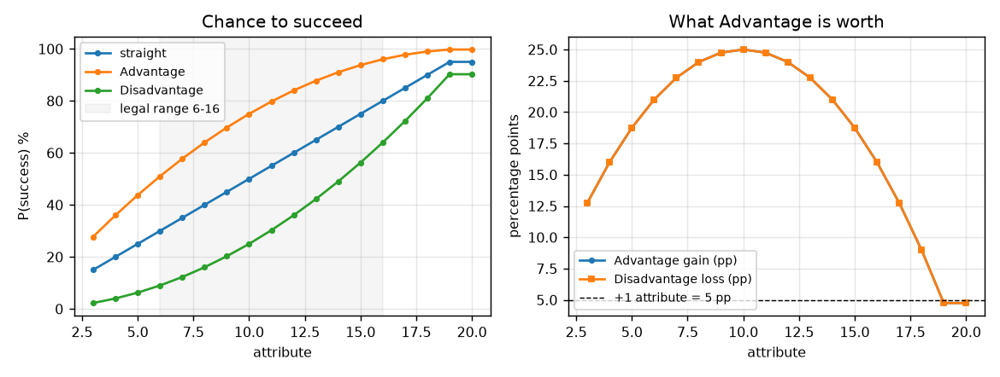

- Success is linear in the attribute at 5 percentage points per point, from 30% at 6 to 80% at 16. There is no curve to learn.
- Natural 1 and natural 20 give a fixed 5% floor and ceiling at every score. Within the legal range they never bind, so the die keeps a say for every character.
- **Advantage is not worth a fixed amount.** It adds 25 points at attribute 10 and 16 at 16 (21 at 6). Measured in attribute points, Advantage is worth five at 10 and three at 16. Disadvantage mirrors it exactly.

What this means for tuning: anything priced in Advantage (tags, knacks, cover, Totem Mark) is most valuable to a character of middling skill and least valuable to a specialist at the ceiling. That is a natural damper on spiking, and it is worth saying out loud in the Almanac.

## 2. Margin and the damage bonus

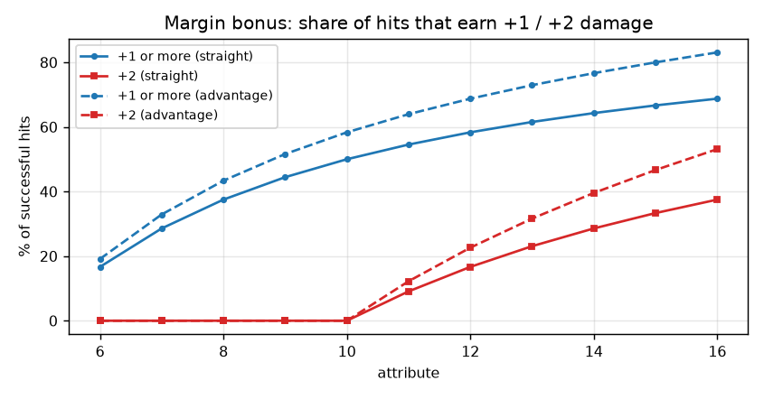

- Every full 5 points of margin adds +1 damage. Among successful hits, the share earning at least +1 rises from 17% at attribute 6 to 69% at 16; the share earning +2 starts at attribute 11 (9%) and reaches 38% at 16. The +3 step would need attribute 17, so the ceiling caps ordinary hits at +2.
- The only step a player can feel is 11 to 12, where +2 first becomes reachable: it adds +1 damage on one hit in twelve. Everything else is a gentle slope.
- Advantage roughly doubles the +2 rate for a given attribute, because keeping the lower die deepens the margin as well as landing the hit.

## 3. Opposed tests

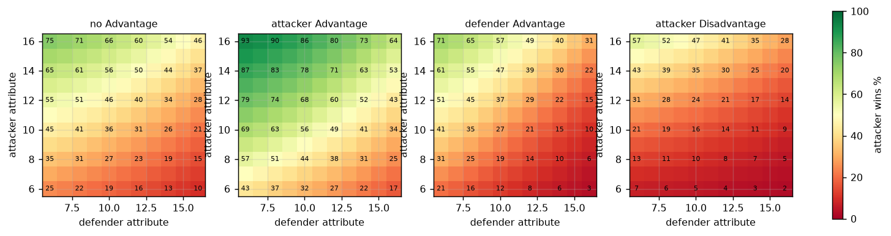

- Ties and double failures go to the defender, so at equal scores the attacker wins between 25% (6 v 6) and 46% (16 v 16). This is the stated design choice, discussed in the Almanac Toolkit; the grid shows how steep it is at low scores, where half of all 6 v 6 exchanges are double failures.
- **Advantage is worth about twice as much on attack as on defence.** At 10 v 10, attacker Advantage lifts the attacker from 36% to 56%; defender Advantage only cuts the attacker to 27%. The reason is the tie rule: the defender already owns the whole band of ties and double failures, so a better defence die has less room to help. The asymmetry narrows at high scores (18 points versus 15 at 16 v 16) but never closes.

| matchup | attacker | attacker with Adv | defender with Adv |
|---|---|---|---|
| 8 v 8 | 31% | 51% | 25% |
| 12 v 12 | 41% | 60% | 29% |
| 16 v 16 | 46% | 64% | 31% |

What this means for tuning: the Almanac's Advantage source list treats "solid cover (Dodge Adv)" and "high ground (Melee Adv)" as equivalent boons. They are not. Granting Advantage to the attacker is the strong lever; granting it to the defender is the mild one. See also section 10 for where this bites a skin.

## 4. Damage against armour

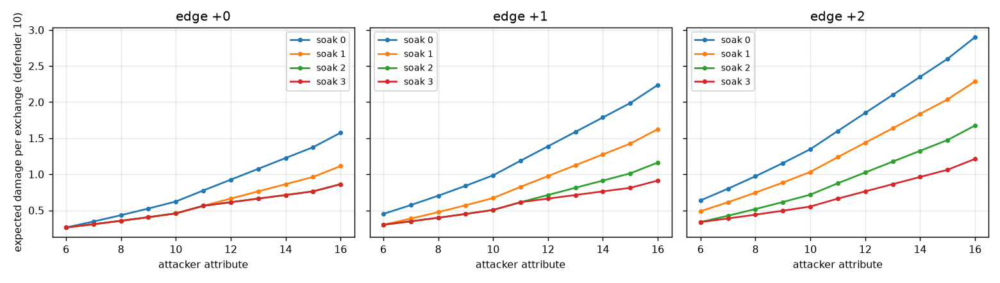

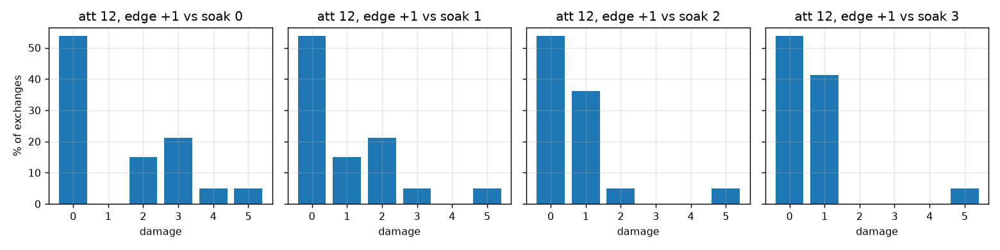

- Expected damage rises smoothly with attribute at every edge and soak. There is no hard zero: a winning hit deals at least 1.
- The floor makes armour tiers converge against weak blows. With a fist (edge +0), soak 1, 2 and 3 are indistinguishable for any attacker below 12. With a blade (edge +1), mail and plate are identical for attackers below 12 and nearly so above. Plate only separates from mail against edge +2 weapons.

| attacker | soak 1 | soak 2 | soak 3 |
|---|---|---|---|
| Peasant fist (8, +0) | 82% | 82% | 82% |
| Soldier blade (10, +1) | 68% | 51% | 51% |
| Monster maul (14, +2) | 78% | 56% | 41% |

(expected damage as a share of the unarmoured value)

What this means for tuning: the book's fiction says plate is heavier and rarer than mail. The maths says plate buys nothing over mail unless the enemy carries a great-axe, rifle or plasma weapon. Either the fiction should say so (plate is for fighting monsters), or plate should carry a second property such as reducing the margin bonus by one. The former costs nothing; the latter is a rule.

## 5. Time to drop, races, survival, parties

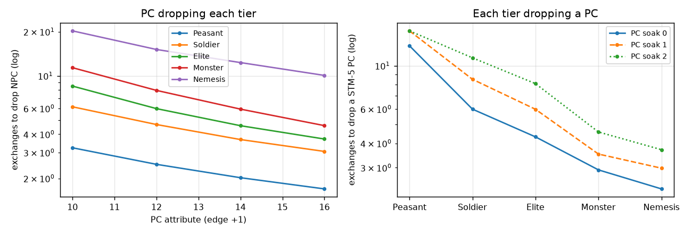

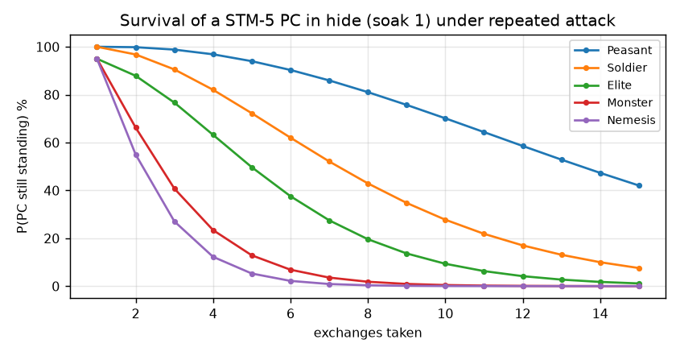

- The tier ladder is well spaced. A standard PC (attribute 12, blade, hide) drops a Peasant in 2.5 exchanges, a Soldier in 4.7, an Elite in 6.0, a Monster in 8.0, a Nemesis in 15. The same PC is dropped by those tiers in 17.6, 9.8, 6.7, 3.9 and 3.2 exchanges. The race ratios run 0.14, 0.48, 0.89, 2.05, 4.67: the Elite is an even fight, the Monster wins two to one, the Nemesis five to one.
- Survival curves show the same story from the player's side. Against an Elite, a hide-clad PC has a 50% chance of still standing after about six exchanges; against a Nemesis, after three.
- Parties change the picture more than armour does. Three standard PCs drop a Nemesis in 5.4 rounds and lose about 12 Stamina between them doing it, which is two and a half characters' worth. Four PCs bring that to 4.2 rounds and 9.5 Stamina. A Nemesis is a party-killer unless the party changes the terms, which is what the Adventurer chapter tells players to do.

What this means for tuning: nothing here needs a rule change. It does argue for one sentence in the NPC design section stating the intended party size for each tier ("an Elite is a fair fight for one PC; a Monster for two; a Nemesis for a party that has stacked the odds").

## 6. Luck

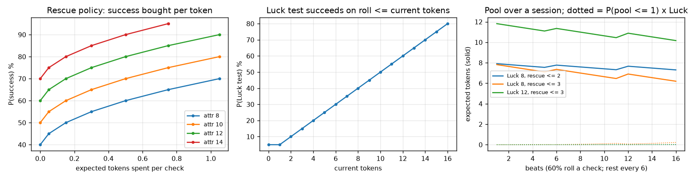

- Rescuing a miss costs exactly the deficit, so the price of success rises linearly and the return is a flat 5 points per rescue tier. A rescue-at-deficit-3 policy costs 0.3 tokens per check and lifts success by 15 points at any attribute.
- **The pool is sustainable.** With a rest every six beats and rescues up to deficit 3, a Luck-8 character carries about 6 tokens after sixteen beats and has a 3% chance of being down to one. Luck 12 barely moves. The Almanac's "under 4 tokens, walk gingerly" is conservative advice; players can spend more freely than the book implies, which is probably the right side to err on.
- The spendable pool is the real cost of dumping Luck, not the Luck test. A Luck-6 character on the same policy sits at 4.3 tokens after sixteen beats with a 9% chance of being nearly empty. That is the number the sample builds should be judged against.
- In opposed tests, with both dice read first as the rules say, a token buys 50 percentage points of win chance when it is spent to flip a lost tie. That is the best exchange rate in the game and it is deliberate.

## 7. Creation economy and powerbuilding

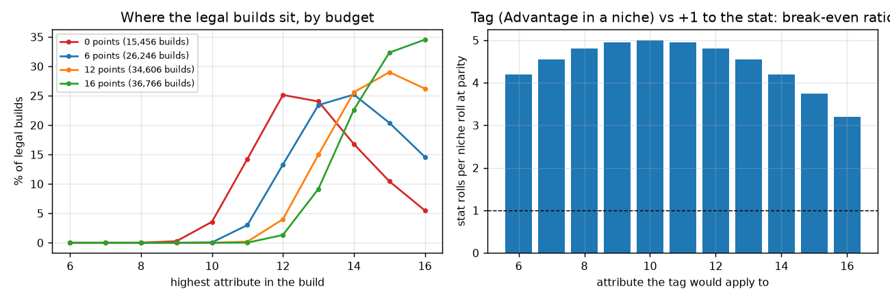

- There are 26,246 legal 6-point builds. The typical one tops out at 13 or 14; 14.6% carry a 16. The grim budget (0 points) still allows 850 builds with a 16, all of them by gutting three other scores.
- **Spiking pays only when the player can steer rolls.** The table below prices five archetypes at the standard budget by the share of rolls that use the best stat. Below about 25% steering, the flat build is as good as any spike. At 60% steering the 16-spike is 13 points better than flat, and pays for it with Stamina 3 (an Elite drops it in 4.1 exchanges instead of 6.0) or with three dumped stats.

| build | scores | 20% steer | 40% | 60% | Elite drops in |
|---|---|---|---|---|---|
| flat | 11, 11, 11, 10, 10; STM 5 | 51% | 52% | 53% | 6.0 |
| signature 12 | 12, 11, 10, 10, 10; STM 5 | 53% | 55% | 57% | 6.0 |
| spike 14, dump STM | 14, 10, 10, 10, 10; STM 3 | 54% | 58% | 62% | 4.1 |
| spike 16, dump Luck and STM | 16, 10, 10, 10, 6; STM 3 | 52% | 59% | 66% | 4.1 |
| spike 16, dump three | 16, 8, 8, 8, 10; STM 5 | 50% | 58% | 65% | 6.0 |

- **A tag is priced fairly against +1 to a stat.** At attribute 10, one niche roll with Advantage is worth five ordinary rolls with +1. The ratio falls to 3.2 at attribute 16. So a tag on a middling stat is a bargain if the niche comes up once in five rolls of that stat, and a tag on a 16 is a bargain if it comes up once in three. The steering assumption decides it, which is the Custodian's lever.

What this means for tuning: the min-max frontier is gentle and self-limiting. The Custodian who sees a 16-spike should widen the situations, not the rules.

## 8. Advancement

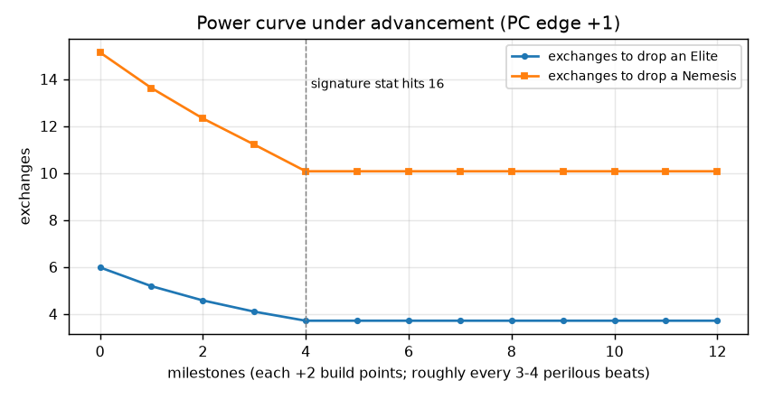

- A milestone every 3-4 perilous beats grants +2 points. A character who pours them into a signature stat reaches the 16 ceiling after four milestones, roughly 15 perilous beats. Over that stretch the exchanges needed to drop an Elite fall from 6.0 to 3.7 and a Nemesis from 15 to 10.
- **The power curve then goes flat.** From milestone 4 onward every point buys breadth: Stamina to 9 by milestone 6, a second 16 by milestone 12. Success on the signature stat is capped at 80% for life.
- This is the intended shape. It means a long campaign is played sideways: more tags, more stats at 12 to 14, a hardier body, rather than a taller spike. The Almanac tone-dial note already says the heroic budget buys breadth; the same sentence belongs beside the milestone rule.

## 9. The Pressure fuse

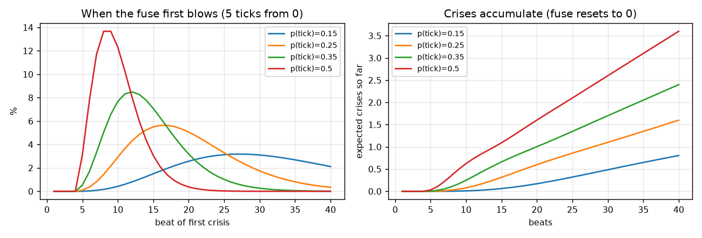

- The fuse is a five-tick counter with a per-beat tick probability the Custodian controls. At a 25% tick rate the first crisis lands after 20 beats on average (10th percentile 11, 90th percentile 30) and a 20-beat session sees 0.6 crises. At 50% it is 10 beats and 1.6 crises.
- One crisis per session corresponds to a tick rate near 35%: roughly one beat in three adds Pressure. That is a useful calibration for Custodians and for the AI prompts.
- Skins that make step 4 a tax (every risky test costs a Luck token or another tick) add about 0.1 to 0.15 crises per session at these rates. The tax is a mood effect more than a pacing one.

## 10. Skin procedures

- **Candlelight spellcraft.** Paying every cost with Fatigue, a Spell always costs 1, a Greater Spell 1.2 to 1.5 depending on the caster's stat, an Arcanum 2 plus a backlash and crisis roll on failure. The tiers are spaced sensibly.
- **Twilight injurious blows.** The Deflection test at 10 + 2 × soak gives a 50% chance of Injury unarmoured, 40% in riveted mail, 30% in a hauberk. Smooth.
- **Free Traders jump legs.** A crew with EDU 10 filling both roles expects one Strain per jump and half a Hull tick. Strain reaches crisis in about five jumps unless cleared, which is probably the intended pressure, but a weak crew (EDU 8) gets there in four.
- **Twilight combat stances.** This is the one module the atlas flags as unbalanced. Vanguard (Advantage on attack, Disadvantage on defence) against Steady, for a PC 12 against an Elite 12:

| stance | damage dealt per round | damage taken | ratio |
|---|---|---|---|
| Vanguard | 1.43 | 1.05 | 1.36 |
| Steady | 0.87 | 0.87 | 1.00 |
| Watchful | 0.31 | 0.70 | 0.45 |

Vanguard deals 64% more and takes only 20% more, because of the attack-versus-defence asymmetry in section 3. Its only brake is that an Injured character cannot take it. Watchful cuts damage taken by a fifth and damage dealt by two thirds, so no one should ever choose it. Options: give Vanguard a heavier cost (hits against you deal +1 damage, rather than your defence at Disadvantage), or make Watchful cost nothing on attack (Advantage on defence only), or both.

## 11. Cliff scan

Every discrete threshold in the engine, with its size:

| threshold | where | size | verdict |
|---|---|---|---|
| d20 granularity | every point | 5 pp | inherent, smooth |
| natural 1 and 20 | every score | 5% each | never bind inside 6-16 |
| Advantage value | peaks at 10 | 25 pp at 10, 16 pp at 16 | a feature: damps spikes |
| margin +1 | attribute 7 | 29% of hits at 7, 69% at 16 | reachable by everyone |
| margin +2 | attribute 12 | 17% of hits at 12, 38% at 16 | the one felt step; small |
| margin +3 | attribute 17 | unreachable | ceiling caps hits at +2 |
| damage floor | soak at or above 1 + edge + bonus | mail = plate vs blades | fiction should say so, or plate needs a second property |
| defender wins ties | all opposed tests | attacker 25% to 46% at parity | stated choice |
| Advantage asymmetry | all opposed tests | attack Adv worth 2x defence Adv | undocumented; affects Twilight stances and the Advantage source list |
| Luck test | roll under current tokens | 5 pp per token spent | smooth; 0 and 1 token both give 5% |
| attribute ceiling 16 | lifetime | success caps at 80% | advancement goes sideways after 4 milestones |
| Stamina ceiling 9 | lifetime | Elite needs 1.8x the exchanges vs STM 5 | fine |
| tag price | 2 points | parity at 5 stat rolls per niche roll (at 10), 3 (at 16) | fair; Custodian steers |

## 12. Findings for the beta test, ranked

1. **Twilight stances are unbalanced.** Vanguard dominates; Watchful is never correct. Rule change warranted in the skin, not the core.
2. **Advantage on attack is worth twice Advantage on defence.** Undocumented. Worth one sentence in the Almanac's Advantage source list so Custodians hand out the strong lever knowingly.
3. **Plate is mail against anything but a brutal weapon.** A fiction fix (state what plate is for) or a rule fix (plate blunts the margin bonus by one). The atlas leans to the fiction fix.
4. **Luck is more sustainable than the book's advice implies.** No rule change; the "walk gingerly" guideline could be softened, and the sample builds with Luck 8 are safe.
5. **Advancement plateaus after four milestones.** Intended, but the milestone rule should say so as the tone-dial note does, so players expect a sideways campaign.
6. **Party-size guidance is missing from NPC design.** One sentence: Elite for one PC, Monster for two, Nemesis for a party that has stacked the odds.
7. **Pressure calibration.** One crisis per session at roughly one tick in three beats. Useful for the AI prompts, which currently say only "advance Pressure for blunders and bargains".

Everything not listed here came out of the sweep looking as intended: the success curve, the margin steps, the tier ladder, the tag price, the creation economy's min-max frontier, and the skin spellcraft and travel modules.
