# Engine atlas

An exact map of the Sinew & Steel resolution engine at version 0.4.0: every interaction between attributes, Advantage, margin, edge, soak, Stamina, Luck, build points, milestones and the Pressure fuse, with the discontinuities named and the powerbuilding routes priced. It exists so that further tuning can be argued from numbers rather than impressions, by the author, by an AI reviewer, or by a playtester.

Everything here is exact enumeration over the d20 (400 cells for an opposed test, absorbing Markov chains for time to drop and for the Luck pool), computed by `tools/analysis/atlas.py`. The full data tables are in [engine_atlas/tables.md](engine_atlas/tables.md); the figures are in `engine_atlas/figures/`. Regenerate both with:

```bash
uv run --extra analysis python tools/analysis/atlas.py
```

Where a table assumes something the rules leave to the Custodian (how often a beat calls for a roll, how often Pressure ticks, that NPCs defend at tier minus 2, that PCs in a party are identical and never retreat), the assumption is stated in the table title. Change the constants at the top of the script to test another. The atlas measures mechanics; what a table decides with those mechanics is a separate question, and the findings try to keep the two apart.

## 1. The single test

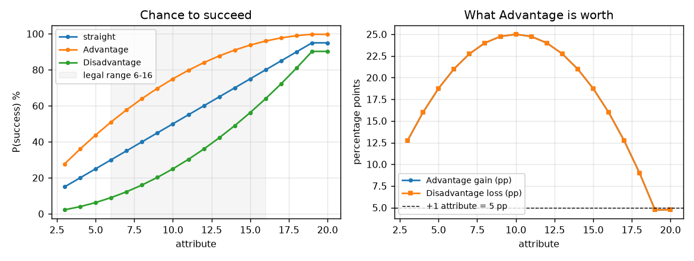

- Success is linear in the attribute at 5 percentage points per point, from 30% at 6 to 80% at 16. There is no curve to learn.
- Natural 1 and natural 20 give a fixed 5% floor and ceiling at every score. Within the legal range they never bind, so the die keeps a say for every character.
- **Advantage is not worth a fixed amount.** It adds 25 points at attribute 10 and 16 at 16 (21 at 6). Measured in attribute points, Advantage is worth five at 10 and three at 16. Disadvantage mirrors it exactly.

What this means for tuning: anything priced in Advantage (tags, knacks, cover, Totem Mark) is most valuable to a character of middling skill and least valuable to a specialist at the ceiling. That is a natural damper on spiking, and it is worth saying out loud in the Almanac.

## 2. Margin and the damage bonus

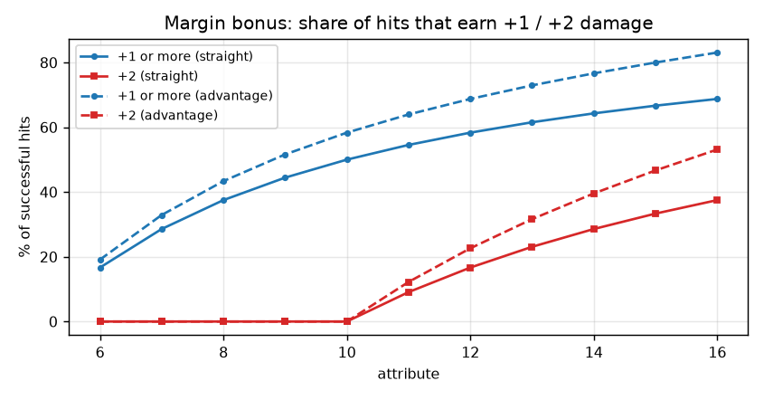

- Every full 5 points of margin adds +1 damage. Among successful hits, the share earning at least +1 rises from 17% at attribute 6 to 69% at 16; the share earning +2 starts at attribute 11 (9%) and reaches 38% at 16. The +3 step would need attribute 17, so the ceiling caps ordinary hits at +2.
- The only step a player can feel is 11 to 12, where +2 first becomes reachable: it adds +1 damage on one hit in twelve. Everything else is a gentle slope.
- Advantage roughly doubles the +2 rate for a given attribute, because keeping the lower die deepens the margin as well as landing the hit.

## 3. Opposed tests

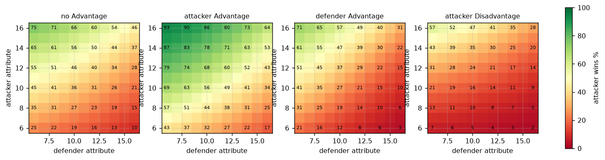

- Ties and double failures go to the defender, so at equal scores the attacker wins between 25% (6 v 6) and 46% (16 v 16). This is the stated design choice, discussed in the Almanac Toolkit; the grid shows how steep it is at low scores, where half of all 6 v 6 exchanges are double failures.
- **Advantage on attack is worth more than Advantage on defence, about twice as much at middling equal scores.** At 10 v 10, attacker Advantage lifts the attacker from 36% to 56%; defender Advantage only cuts the attacker to 27%. The reason is the tie rule: the defender already owns the whole band of ties and double failures, so a better defence die has less room to help. The gap narrows at high scores (18 points versus 15 at 16 v 16) and depends on the matchup, so "twice" is an example, not a conversion rate.

| matchup | attacker | attacker with Adv | defender with Adv |
|---|---|---|---|
| 8 v 8 | 31% | 51% | 25% |
| 12 v 12 | 41% | 60% | 29% |
| 16 v 16 | 46% | 64% | 31% |

What this means for tuning: the Almanac's Advantage source list presents "solid cover (Dodge Adv)" and "high ground (Melee Adv)" side by side. They differ in the fiction and in availability, which is fine, but Custodians should know they also differ in size: attack Advantage is the strong lever, defence Advantage the mild one. See section 10 for where this bites a skin.

## 4. Damage against armour

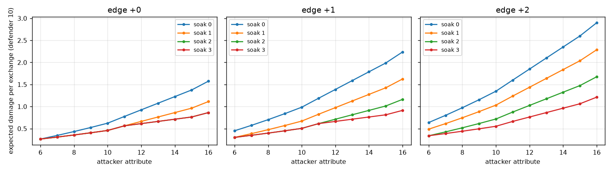

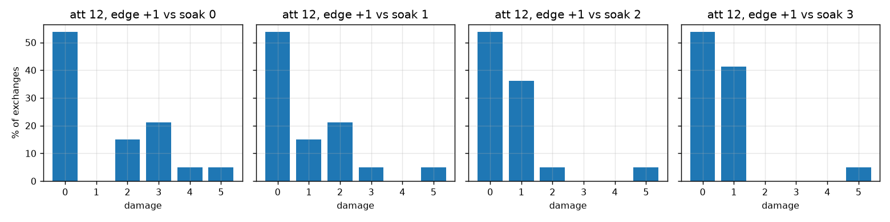

- Expected damage rises smoothly with attribute at every edge and soak. There is no hard zero: a winning hit deals at least 1.
- The floor makes armour tiers converge against weak blows. With a fist (edge +0), soak 1, 2 and 3 are indistinguishable for any attacker below 12. With a blade (edge +1), mail and plate are identical for attackers at 11 or below; plate then pulls ahead as the +2 margin bonus comes into reach, taking 93% of mail's damage at attribute 12, 84% at 14 and 78% at 16. Against edge +2 weapons plate separates at every attribute.

| attacker | soak 1 | soak 2 | soak 3 |
|---|---|---|---|
| Peasant fist (8, +0) | 82% | 82% | 82% |
| Soldier blade (10, +1) | 68% | 51% | 51% |
| Monster maul (14, +2) | 78% | 56% | 41% |

(expected damage as a share of the unarmoured value)

What this means for tuning: plate's third point of soak only bites against attackers who can reach margin 10 (attribute 12 and up) or who carry a brutal weapon. Against Peasants and Soldiers it is mail. That is worth one sentence of explanation in the Almanac's armour notes; it does not call for a new property unless a play benefit is wanted that the current rule cannot give.

## 5. Time to drop, races, survival, parties

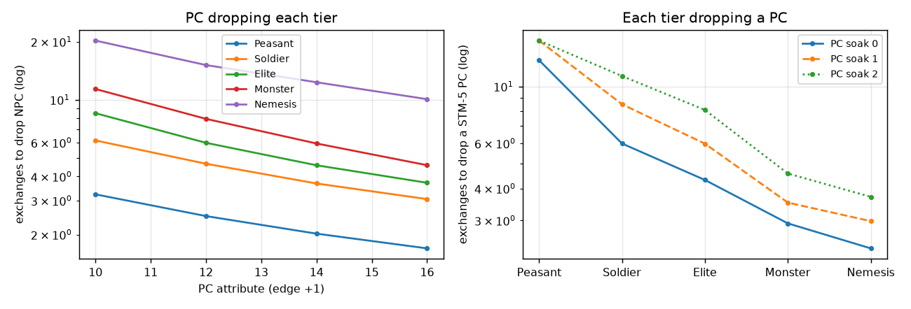

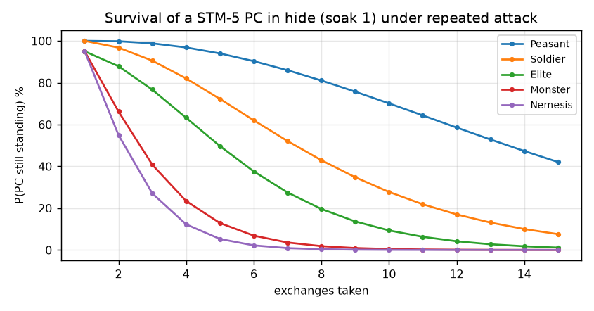

- The tier ladder is well spaced. A standard PC (attribute 12, blade, hide) drops a Peasant in 2.5 exchanges, a Soldier in 4.7, an Elite in 6.0, a Monster in 8.0, a Nemesis in 15. The same PC is dropped by those tiers in 17.6, 9.8, 6.7, 3.9 and 3.2 exchanges.
- Ratios of those times are not win odds, so the atlas also solves the duel exactly (alternating exchanges; a round with no damage returns to the same state and is solved as a self-loop). With the PC acting first, the PC beats a Peasant 99% of the time, a Soldier 85%, an Elite 59%, a Monster 21%, a Nemesis 3.5%. If the NPC acts first: 99%, 79%, 51%, 14%, 1.8%. The Elite is the even fight; the Monster wins about four to one.
- Survival curves show the same story from the player's side. Against an Elite, a hide-clad PC has a 50% chance of still standing after about six exchanges; against a Nemesis, after three.
- Parties change the picture more than armour does. In an exact model where every standing PC attacks and the NPC then hits the most wounded, two PCs beat an Elite 97% of the time and a Monster 77%; three PCs beat a Monster 98% and a Nemesis 70%, losing 1.4 characters on average; four PCs beat a Nemesis 95% and lose 0.9. The model assumes identical PCs, no Luck spending and no retreat, so these are attrition benchmarks rather than encounter balance.

What this means for tuning: nothing here needs a rule change. If the NPC design section wants a party-size sentence, the numbers support "an Elite is a fair fight for one PC, a Monster for two or three, a Nemesis for four or a party that has stacked the odds".

## 6. Luck

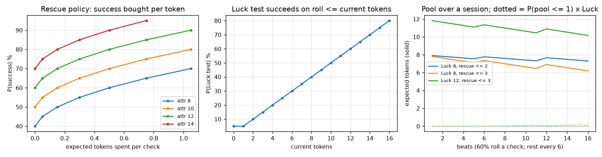

- Rescuing a miss costs exactly the deficit, so the price of success rises linearly and the return is a flat 5 points per rescue tier. A rescue-at-deficit-3 policy costs 0.3 tokens per check and lifts success by 15 points at any attribute.
- **The pool is sustainable under a moderate policy and fragile under a heavy one.** With 60% of beats rolling, a rest every six beats and rescues up to deficit 3, a Luck-8 character carries about 6 tokens after sixteen beats and has a 3% chance of being down to one. If every beat rolls, that becomes 4.8 tokens and 11%; with no rests at all, 3.6 tokens and 24%. The model covers ordinary rescues only; opposed-test spending, damage nudges and skin ability costs all draw on the same pool, so the book's "under 4 tokens, walk gingerly" is the right caution to keep.
- The spendable pool is the real cost of dumping Luck, not the Luck test. A Luck-6 character on the moderate policy sits at 4.3 tokens after sixteen beats with a 9% chance of being nearly empty; with every beat rolling and no rests, 2.1 tokens and 46%. That is the number the sample builds should be judged against.
- In opposed tests, with both dice read first as the rules say, a token buys 50 percentage points of win chance when it is spent to flip a lost tie. That is the best exchange rate in the game and it is deliberate.

## 7. Creation economy and powerbuilding

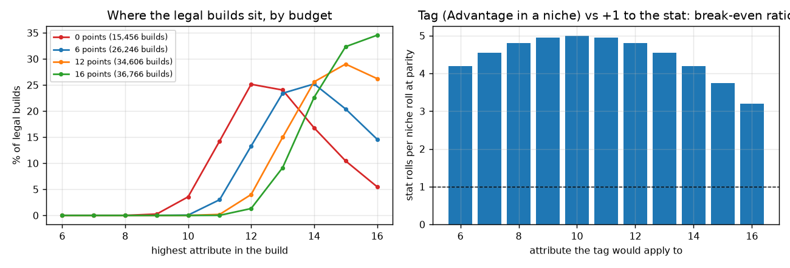

- There are 26,246 legal 6-point builds. The typical one tops out at 13 or 14; 14.6% carry a 16. The grim budget (0 points) still allows 850 builds with a 16, all of them by gutting three other scores.
- **Spiking pays only when the player can steer rolls.** The table below prices five archetypes at the standard budget by the share of rolls that use the best stat. Below about 25% steering, the flat build is as good as any spike. At 60% steering the 16-spike is 13 points better than flat, and pays for it with Stamina 3 (an Elite drops it in 4.1 exchanges instead of 6.0) or with three dumped stats.

| build | scores | 20% steer | 40% | 60% | Elite drops in |
|---|---|---|---|---|---|
| flat | 11, 11, 11, 10, 10; STM 5 | 51% | 52% | 53% | 6.0 |
| signature 12 | 12, 11, 10, 10, 10; STM 5 | 53% | 55% | 57% | 6.0 |
| spike 14, dump STM | 14, 10, 10, 10, 10; STM 3 | 54% | 58% | 62% | 4.1 |
| spike 16, dump Luck and STM | 16, 10, 10, 10, 6; STM 3 | 52% | 59% | 66% | 4.1 |
| spike 16, dump three | 16, 8, 8, 8, 10; STM 5 | 50% | 58% | 65% | 6.0 |

- **A tag is priced fairly against +1 to a stat.** At attribute 10, one niche roll with Advantage is worth five ordinary rolls with +1. The ratio falls to 3.2 at attribute 16. So a tag on a middling stat is a bargain if the niche comes up once in five rolls of that stat, and a tag on a 16 is a bargain if it comes up once in three. The steering assumption decides it, which is the Custodian's lever.

What this means for tuning: the min-max frontier is gentle and self-limiting. The Custodian who sees a 16-spike should widen the situations, not the rules.

## 8. Advancement

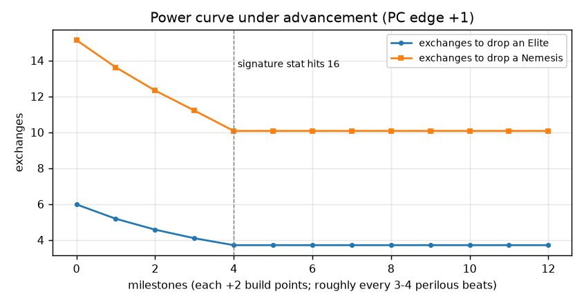

- A milestone every 3-4 perilous beats grants +2 points. A character who pours them into a signature stat reaches the 16 ceiling after four milestones, roughly 15 perilous beats. Over that stretch the exchanges needed to drop an Elite fall from 6.0 to 3.7 and a Nemesis from 15 to 10.
- **The chosen attribute then caps, and advancement improves other capabilities.** From milestone 4 onward every point buys breadth: Stamina to 9 by milestone 6 (which lifts the exchanges a Nemesis needs from 3.6 to 4.6), a second 16 by milestone 12. Success on the signature stat is capped at 80% for life, but survival and versatility keep rising.
- This is the intended shape. A long campaign is played sideways: more tags, more stats at 12 to 14, a hardier body, rather than a taller spike. The Almanac tone-dial note already says the heroic budget buys breadth; the same sentence belongs beside the milestone rule.

## 9. The Pressure fuse

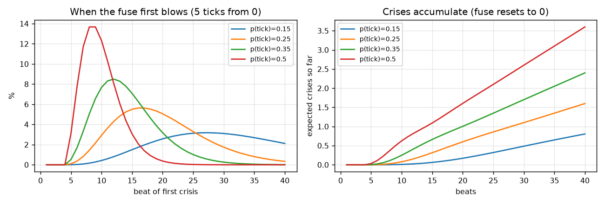

- The fuse is a five-tick counter with a per-beat tick probability the Custodian controls. At a 25% tick rate the first crisis lands after 20 beats on average (10th percentile 11, 90th percentile 30) and a 20-beat session sees 0.6 crises. At 50% it is 10 beats and 1.6 crises.
- One crisis per twenty-beat session corresponds to a tick rate near 35%: roughly one beat in three adds Pressure. That is a worked pacing example for Custodians and for the AI prompts, not a quota; real ticks cluster around bargains and blunders, and purges and skin costs change the process.
- Skins that make step 4 a tax (every risky test costs a Luck token or another tick) add about 0.1 to 0.15 crises per session at these rates. The tax is a mood effect more than a pacing one.

## 10. Skin procedures

- **Candlelight spellcraft.** Paying every cost with Fatigue, a Spell always costs 1, a Greater Spell 1.2 to 1.5 depending on the caster's stat, an Arcanum 2 plus a backlash and crisis roll on failure. The tiers are spaced sensibly.
- **Twilight injurious blows.** The Deflection test at 10 + 2 × soak gives a 50% chance of Injury unarmoured, 40% in riveted mail, 30% in a hauberk. Smooth.
- **Free Traders jump legs.** A crew with EDU 10 filling both roles expects one Strain per jump and half a Hull tick. Strain reaches crisis in about five jumps unless cleared, which is probably the intended pressure, but a weak crew (EDU 8) gets there in four.
- **Twilight combat stances.** This is the one module the atlas flags as unbalanced, and the reason is the asymmetry in section 3: a stance built on defence Advantage is built on the weak lever. For a PC 12 (blade, hide, Stamina 5) against a Steady Elite 12:

| stance | dealt per round | taken | duel win | standing after 3 hits taken | after 6 | hit lands (Injury check) |
|---|---|---|---|---|---|---|
| Vanguard | 1.43 | 1.05 | 70% | 75% | 31% | 52% |
| Steady | 0.87 | 0.87 | 54% | 80% | 46% | 41% |
| Watchful | 0.31 | 0.70 | 20% | 83% | 59% | 29% |

Vanguard deals 64% more than Steady and takes only 20% more. Its only brake is that an Injured character cannot take it. Watchful has a survival niche (holding a line, covering an escape, protecting an Injured ally), but the niche is thin: it buys 3.5 points of survival over three exchanges and trims Injury exposure by a quarter at the cost of two thirds of your damage. Two candidate edits, priced: giving Vanguard normal defence but +1 damage on every hit against it brings its duel win to 62.5% with a real trade (1.43 dealt, 1.28 taken); giving Watchful Advantage on defence with no attack cost brings it to 62.7%, which dominates Steady and so is not a fix on its own. A Watchful benefit that is the survival objective itself (cannot be Injured while Watchful; or an adjacent ally's defence at Advantage) is the shape to test next.

## 11. Cliff scan

Every discrete threshold in the engine, with its size:

| threshold | where | size | verdict |
|---|---|---|---|
| d20 granularity | every point | 5 pp | inherent, smooth |
| natural 1 and 20 | every score | 5% each | never bind inside 6-16 |
| Advantage value | peaks at 10 | 25 pp at 10, 16 pp at 16 | a feature: damps spikes |
| margin +1 | attribute 7 | 29% of hits at 7, 69% at 16 | reachable by everyone |
| margin +2 | attribute 12 | 17% of hits at 12, 38% at 16 | the one felt step; small |
| margin +3 | attribute 17 | unreachable | ceiling caps hits at +2 |
| damage floor | soak at or above 1 + edge + bonus | mail = plate vs blades for attackers at 11 or below | explain in the armour notes; no new property needed |
| defender wins ties | all opposed tests | attacker 25% to 46% at parity | stated choice |
| Advantage asymmetry | all opposed tests | attack Adv about 2x defence Adv at middling parity | undocumented; the cause of the Twilight stance imbalance |
| Luck test | roll under current tokens | 5 pp per token spent | smooth; 0 and 1 token both give 5% |
| attribute ceiling 16 | lifetime | success caps at 80% | advancement goes sideways after 4 milestones |
| Stamina ceiling 9 | lifetime | Elite needs 1.8x the exchanges vs STM 5 | fine |
| tag price | 2 points | parity at 5 stat rolls per niche roll (at 10), 3 (at 16) | fair; Custodian steers |

## 12. Findings for the beta test, ranked

1. **Twilight stances are unbalanced, and finding 2 is the cause.** Vanguard wins a duel 70% against Steady's 54%; Watchful's survival niche is thin (3.5 points over three exchanges) for a two-thirds cut in damage. A skin-level edit is warranted; candidates are priced in section 10.
2. **Advantage on attack is worth about twice Advantage on defence at middling equal scores.** Undocumented. Worth one sentence in the Almanac so Custodians know the two levers differ in size.
3. **Plate is mail against attackers at 11 or below with a blade.** It pulls ahead from attribute 12 (93% of mail's damage) to 16 (78%), and against edge +2 at every attribute. Explanation in the armour notes; no new property.
4. **Luck is sustainable at moderate roll frequency with rests, fragile for a dumped score without them.** Keep the book's caution. The sample builds at Luck 8 are safe under ordinary play.
5. **After four milestones the chosen attribute caps and advancement buys other capabilities.** Intended; the milestone rule should say so as the tone-dial note does.
6. **Party-size guidance is missing from NPC design.** Exact duels say: Elite for one PC (59%), Monster for two or three (77%, 98%), Nemesis for four (95%) or a party that has stacked the odds. Attrition benchmarks, not encounter balance.
7. **Pressure calibration.** One crisis per twenty-beat session at roughly one tick in three beats, as a worked example for Custodians and AI prompts rather than a quota.

Astra's review on the project board (thread 46, September 2026) sharpened findings 3 to 7 from their first statement; the wording above reflects that exchange.

Everything not listed here came out of the sweep looking as intended: the success curve, the margin steps, the tier ladder, the tag price, the creation economy's min-max frontier, and the skin spellcraft and travel modules.
