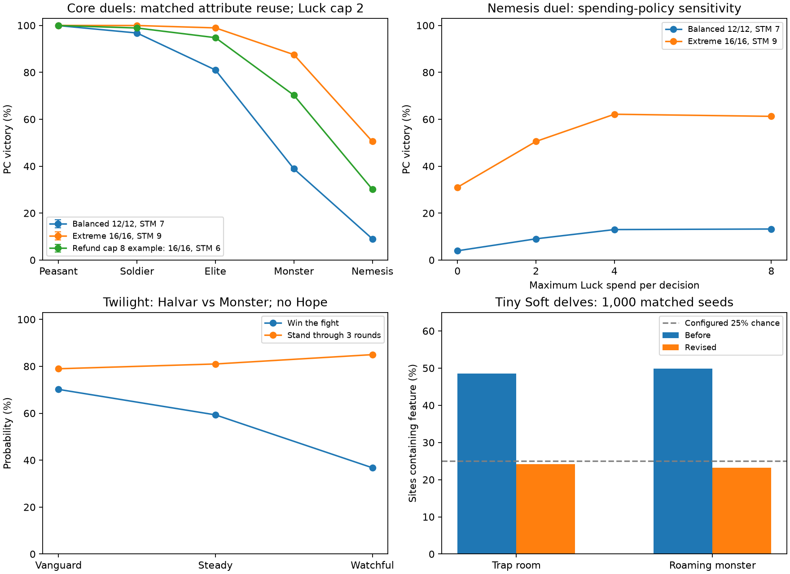
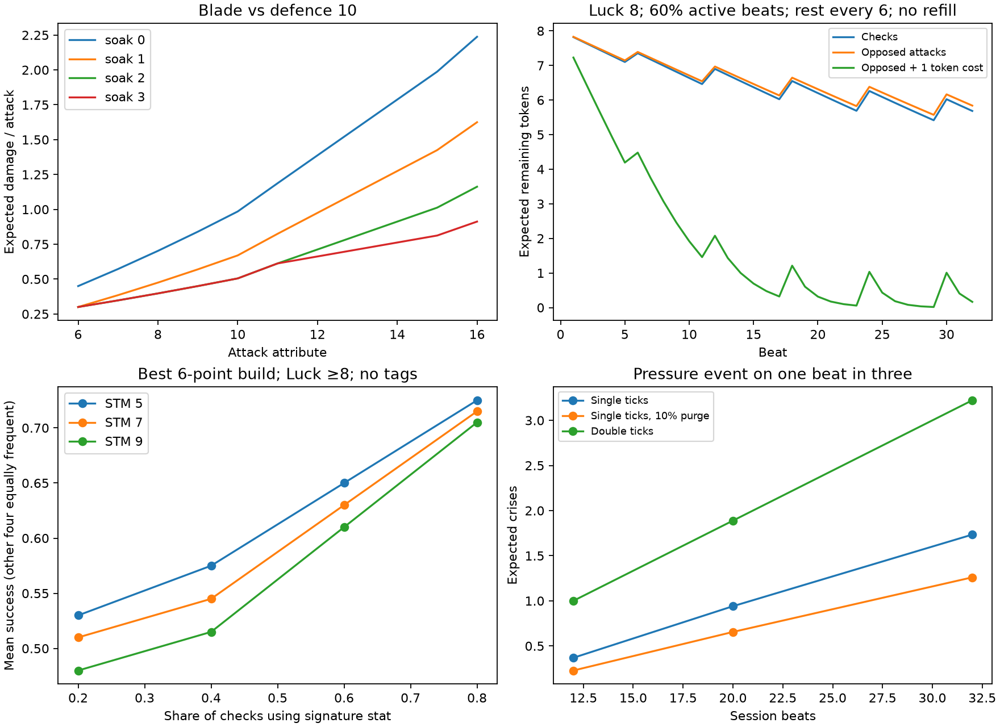

# Independent Sinew & Steel engine review

20 September 2026. Rules baseline: `a77d476`, version 0.4.0. The working tree now
contains the bounded repairs below; no commit or release was made.

## Decision

**Keep the resolution engine; repair the procedures around it.** The damage
floor prevents armour immunity, the small integer margin steps remain bounded,
and Twilight positions serve different objectives. The strongest threats to
robust play are ambiguous cost/timing rules, repeatable rewards, and allowing
one specialised attribute to answer nearly every problem.

The mathematics does **not** establish a powergame-proof ruleset. Within a
fiction-led game, the applicability of attributes, tags, equipment and spells
is itself a balancing mechanism. The revised Markdown makes that responsibility
explicit rather than pretending that point-buy alone supplies it.

## What was examined

- Every labelled allocation of five attributes 6–16 and Stamina 3–9:
  **1,127,357 combinations**, with creation budgets 0/6/12/16 and tag costs.
- **1,452 exact combat cells** across attack, defence, weapon edge and soak,
  plus Advantage/Disadvantage, natural faces and informed Luck spending.
- **74 combat scenarios × 20,000 fights = 1.48 million simulated fights**,
  including actual casualties and lost turns, initiative, targeting, finite
  Luck, alternative spending policies, NPC defence assumptions, and Twilight
  positions/Injury. Wilson intervals quantify Monte Carlo uncertainty.
- **108 exact Luck-budget scenarios** and **36 Pressure-pacing scenarios**.
- All ten skins and Delvekit: quantitative checks where a procedure has numeric
  outcomes, adversarial worked sequences where its outcomes are fictional.
- **9,000 generated dungeons before and 9,000 after** the generator repair,
  using matched seeds. These measure generated features, not player mortality.



## 1. Character specialisation is the main balance exposure

The standard six-point ledger permits `[16, 6, 6, 6, 8]` with **Stamina 9**.
It does not require a fragile character to obtain maximum offence. If the 16
also applies to parrying, this is a very capable fighter whose costs are mostly
paid outside combat. There are 15 standard, untagged legal allocations with
one specified attribute at 16 and Stamina 9; with one purchased tag, there is
one such allocation (`[16,6,6,6,6]`, Stamina 9).

A fair comparison lets the balanced character use its signature attribute for
both attack and defence too. Against the defined Nemesis (16/16, Stamina 7,
edge 2, soak 2), identical player gear and a two-token-per-decision Luck policy:

| Build | Attack / defence | Stamina | Luck | PC victory |
|---|---:|---:|---:|---:|
| Balanced, same attribute reused | 12 / 12 | 7 | 8 | 9.0% |
| Extreme, same attribute reused | 16 / 16 | 9 | 8 | 50.6% |
| Extreme, threat forces weak defence | 16 / 6 | 9 | 8 | 23.3% |
| Example under an eight-point refund cap | 16 / 16 | 6 | 8 | 30.2% |

These are **conditional duel probabilities**, not global character ratings or
NPC tier guarantees. With no Luck spending, the matched balanced/extreme
contrast is 3.9% versus 31.0%; with a four-token cap it is 13.0% versus 62.1%.
The size of the advantage depends on the opponent and spending policy.

There is a real cost outside that favourite domain. For ordinary checks, if
the signature gets share `s` and the other four attributes share the rest
equally, the extreme beats `[12,10,10,10,8]` only above **s = 3/7 ≈ 43%**.
That comparison does not price Stamina or the spendable Luck pool. It shows
why a combat result cannot decide the whole character economy.

**Implemented:** the declared method and actual threat determine the attribute.
A parry is not a defence against a ceiling collapse or an unseen shot. Tags have
an agreed specialty and apply whenever it fits, with no stacking or arbitrary
use quota. Rewording an action does not make a favourite score applicable.

**Not implemented:** a refund cap or an attribute-floor increase. An eight-point
refund cap would prevent the simultaneous 16/Stamina-9 extreme, but it would
also narrow deliberate specialist concepts and require re-pricing some builds.
It is a concrete, partially effective alternative, not a numerical necessity.
The principal unresolved design judgement is how much a campaign should reward
specialisation. Artificially forcing weak-stat rolls just to punish a build is
not a good substitute for a varied, credible world.

## 2. Damage and armour have useful limits, not equal tiers everywhere

For a blade against defence 10, expected damage per attack rises from **0.30**
at attack 6 against plate to **0.91** at attack 16. Winning hits always hurt.
Plate and mail coincide against weaker blade attacks but separate at attribute
12: a non-natural 2 gives margin 10 and deals **2 through mail, 1 through plate**.
The categorical claim that plate only helps against edge 2 is therefore false.

Natural 1s ignore armour and contribute appreciably to damage against plate;
Advantage increases their probability from 5% to 9.75%. An ordinary nudged 1
never gains that property. Small steps remain at integer margin thresholds,
including natural-1 margin bonuses at scores 11 and 16. The largest one-score
increase in expected damage in the tested straight-roll grid is 0.3025 damage
per attack (15→16, defence 15, edge 2, no soak). This is a bounded local step,
not armour immunity or an unbounded scaling loop.

**Decision:** retain edge, soak, minimum damage, natural effects and margin /5.
Better gear is intentionally better; availability and fictional disadvantages
matter, and there is no universal equipment price model to prove every item
has equal utility.

## 3. Twilight stances are a genuine choice

Against a Monster, the same Halvar with no Hope has:

| Position | Win the fight | Stand through three rounds |
|---|---:|---:|
| Vanguard | 70.2% | 79.0% |
| Steady | 59.3% | 81.0% |
| Watchful | 36.8% | 85.0% |

With Hope 12 the ranking persists: Vanguard wins more often; Watchful improves
short-horizon survival. Screened ranged support can make the defensive choice
useful to the company. These experiments do not prove optimal adaptive tactics:
the chosen stance is fixed during each simulated fight.

**Decision:** keep the stance numbers and the optional natural-1 Injury rule.
Making Watchful's attack free of Disadvantage would remove Steady's comparative
benefit. Damage-output ratios alone were insufficient grounds for that change.

## 4. Luck and Pressure depend on the action mix



Under ordinary deficit-at-most-3 rescues, Luck 8, 60% active beats, a rest every
six beats and no milestones, expected Luck after 16 beats is **6.20**; the
chance of at most one token is **2.7%**. Add a one-token ability cost on active
beats and those values become **0.46** and **87.6%**. This is a deliberately
simple extra resource sink, not a model of an unaffordable spell resolving.
Milestone refills reverse much of that depletion. Neither “Luck is scarce” nor
“Luck is sustainable” is a universal conclusion.

At equal score 12, allowing up to three tokens after seeing both dice raises
an attacker's isolated win probability from **40.5% to 54.75%**, at an average
0.285 tokens per offered exchange before pool constraints. The nudge search
allows changes to either or both dice and distinguishes raw from adjusted
natural results. Whole-combat play still uses a heuristic, not an optimal policy.

For a 20-beat session, independent single Pressure ticks with probability 1/3
produce **0.94 expected crises**. Adding a 10% per-beat one-point purge reduces
that to **0.66**; double ticks raise it to **1.89** under reset-without-remainder.
These are scenario calibrations, not a quota for a Custodian.

**Implemented:** use starting Pressure to determine surcharges, charge each
cost once, resolve the action, then its crisis. Multi-point gains reaching or
passing five cause one crisis and reset to zero without carrying excess. A
crisis must have a real consequence. Arcanum/Reckoning/Unspeakable/Wyrd now
specify sequencing without duplicating an upfront cost or adding an unintended
Reckoning failure crisis.

## 5. Skin and harness repairs

| Area | Revised behaviour |
|---|---|
| Dice and Luck | Natural 1/20 override targets, including zero Luck; Luck-key tests read remaining tokens; nudging preserves the pre-spend target and raw natural status. Invalid/over-budget/wrong-owner nudges are rejected. |
| Advantage | Sources do not stack; any Advantage and Disadvantage cancel to one die. |
| Attempts and recovery | One attempt gets one resolution; unchanged retries keep the result. Each applicable rest benefit occurs once per suitable pause; good care replaces ordinary Stamina recovery. |
| Combat sequence | Fictional initiative applies; otherwise a statless side roll establishes order. Each able combatant acts once; dropped characters lose unspent actions. |
| Scans | One free Quick Scan per scene; further scans need changed information/method and a stated time or risk cost. Deep Scan supplies targeted truthful answers within sensor reach. |
| Trade and repairs | Trade needs a real stake, consumed or marked paid on reward; it cannot pay again at another port. Hull repairs require access, tools and time outside a combat exchange. |
| Travel | One test for the main danger; extra roles only for distinct stated hazards. No automatic failure for an irrelevant unfilled role; active hazards still need handling. |
| Twilight recovery and assemblies | One Song for the company per camp/night. Assemblies use one spokesperson and ordinary HRT with fictional leverage, so solo/small parties are not mathematically barred. |
| Knacks | Each entry states its whole cost; extra costs are labelled. A Pressure-cancelling ability cannot pay by cancelling its own charge. |
| Time Odyssey | One test settles an intervention; a repeated attempt needs a materially changed approach or opportunity. Successful changes retain their current cost. |
| Delvekit | Rest costs time under active danger, survival counts belong to an expedition, and Soft's variety floor cannot force a lethal trap or roaming monster. |

In 1,000 paired tiny Soft seeds, trap rooms fell **48.6%→24.2%**, and roaming
monsters **49.9%→23.2%**, close to their configured 25% chances. Other sizes and
difficulties were unchanged. This verifies the generator's hazard frequency,
not real-play lethality.

## Independent checks and limitations

The models do not import Fable's analysis engine. Astra had already seen its
conclusions, so this is independently implemented and critically checked work,
not a blinded study. `baseline.json` records the starting rule hashes. Existing
uncommitted atlas edits were preserved.

Independent review corrected substantive modelling errors before final use:
optional Injury leaking into core baselines, raw/adjusted natural handling,
unequal opportunities for attribute reuse, and an incorrect assumption that
one-die nudges always find the cheapest rescue. The final calculations include
matched controls and the relevant sensitivities. Separate convolution verified
all 16 creation-count cells; binomial identities checked the simple Pressure
process; exact coupled-duel recursion checked simulated initiative outcomes.

All **27 harness tests**, repository validation, and all ten skin prompt/sheet
checks pass. Further book layout work was stopped at Barry's request; Markdown
is the review surface. PDF drafts are not validated release artefacts.

Remaining limits: no optimal campaign-wide policy, adaptive stance search,
morale/retreat model, full NPC-hook library, empirical playtest, or numerical
valuation of arbitrary fictional spell effects. Stockpiled allies, equipment
availability, medical access and fuel economics remain genre/fiction questions,
not secretly solved by the probability tables. The most useful follow-up is a
small adversarial playtest of the revised procedures and the extreme build,
with a stated mixture of physical, social, exploratory and magical obstacles.

## Reproduce and inspect

```sh
uv run --extra analysis python tools/analysis/independent_economy.py
uv run python tools/analysis/independent_combat.py
uv run python tools/analysis/independent_skins.py --delve-seeds 1000 --json
uv run --extra analysis python tools/analysis/independent_figures.py
uv run python -m unittest discover -s tests -q
uv run python tools/validate_repo.py
```

- [Combat methods, scenarios, intervals and controls](combat_analysis.md)
- [Skin coverage, baseline adversarial sequences and dispositions](skin_audit.md)
- [Procedure walkthroughs and verification](verification.md)
- [Combat data](combat_results.csv), [resolution grid](resolution_grid.csv)
- [Creation counts](creation_counts.csv), [conditional frontiers](creation_frontier.csv)
- [Luck sensitivity](luck_sensitivity.csv), [informed nudges](informed_nudges.csv)
- [Pressure sensitivity](pressure_sensitivity.csv)
- [Baseline generator results](skins_baseline.json), [revised generator results](skins_revised.json)

`independent_skins.py` retains the original closed-form fixtures for comparison
while reading the current generator. The saved baseline generator output is
historical evidence; rerunning the revised generator does not recreate it.
